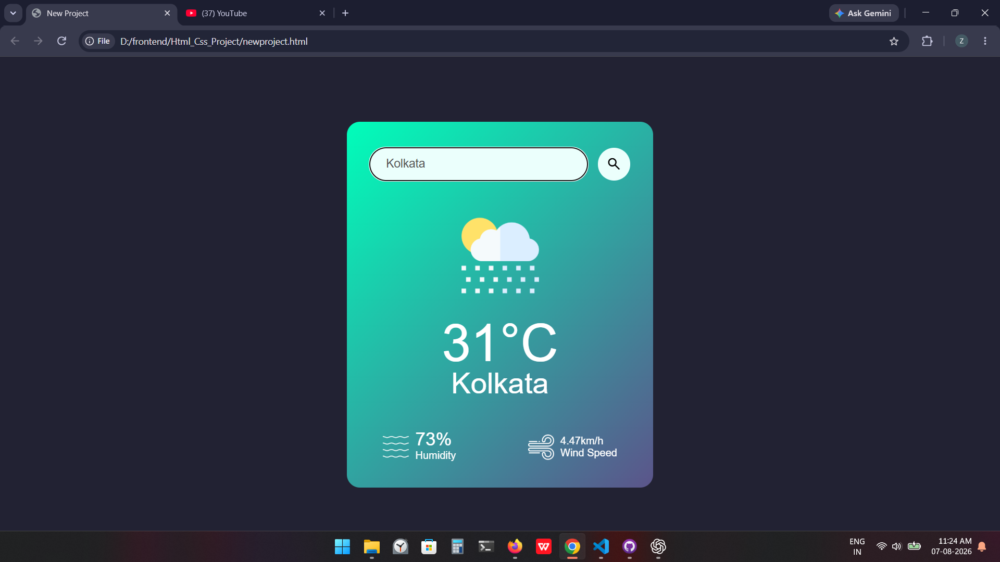

# 🌦️ Weather App

A responsive Weather App built using **HTML, CSS, and JavaScript** that provides real-time weather information for any city using the **OpenWeatherMap API**.

## 🚀 Features

- 🔍 Search weather by city name
- 🌡️ Displays current temperature
- 💧 Shows humidity percentage
- 💨 Displays wind speed
- 🌤️ Dynamic weather icons based on weather conditions
- ❌ Error handling for invalid city names
- 📱 Responsive and modern UI

## 🛠️ Technologies Used

- HTML5
- CSS3
- JavaScript (ES6)
- OpenWeatherMap API

## 📂 Project Structure

```
Weather-App/
│── images/
│── newproject.html
│── newproject.css
│── newproject.js
│── README.md
```

## 📸 Screenshot



## ⚙️ Getting Started

1. Clone the repository:

```bash
git clone https://github.com/your-username/weather-app.git
```

2. Navigate to the project folder:

```bash
cd weather-app
```

3. Open `newproject.html` in your browser.

## 🔑 API Setup

1. Create a free account at **OpenWeatherMap**.
2. Generate your API key.
3. Replace the API key in `newproject.js`:

```javascript
const apiKey = "YOUR_API_KEY";
```

## 🌐 API Used

- OpenWeatherMap Current Weather API

## 🎯 Future Improvements

- 5-day weather forecast
- Current location weather (Geolocation API)
- Dark/Light mode
- Temperature unit toggle (°C/°F)
- Weather animations

---

⭐ If you like this project, don't forget to **star** the repository!